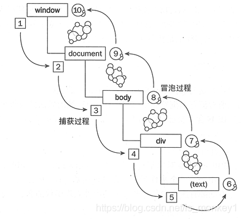
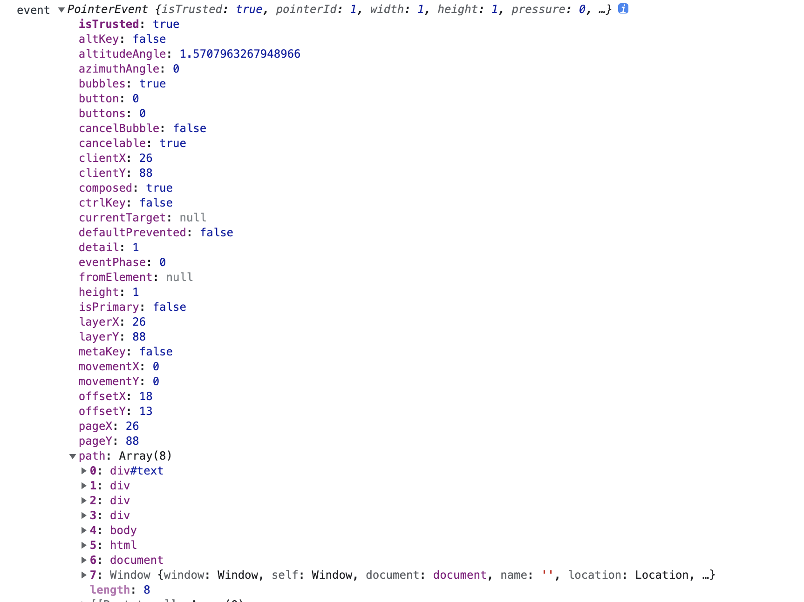

## 事件流

> 一张图说明一切



- 事件捕获从 Document 一直到目标对象
- 事件冒泡从 目标对象 一直到 Document

## 事件对象

### code

```javascript
var text = document.getElementById("text");
text.addEventListener("click", function (event) {
  console.log("event", event);
});
```

### 说明



```
bubbles: true //是否冒泡
cancelBubble: false
cancelable: true // 是否取消默认事件
currentTarget: null  // 当前绑定的元素不管是否冒泡还是捕获
target: div#text // 当前目标元素
```

## 事件类型

- 浏览器事件

  - scroll 滚动事件
  - load 页面加载完成
  - unload 页面卸载
  - resize 页面窗口放生变化

- 焦点事件

  - blur 失焦事件
  - focus 聚焦事件

- 鼠标事件
  - click 点击事件
  - dbclick 双击事件
  - mousedown 按下任意鼠标键时触发
  - mouseup 释放鼠标时触发
  - mouseover 鼠标光标从外部移动到内部
  - mouseout 鼠标光标从内部移动到外部
  - mousemove 在元素上移动

## 常见问题

- 事件代理

  > 本质上是将事件绑定在父容器上（currentTarget） 不需要给每一个子元素绑定

- event.target 和 event.currentTarget 区别

```javascript
 <div id="root">
    <div id="parent" >
      <button id="child">目标</button>
    </div>
  </div>
  <script>
    const root = document.getElementById('root')
    const parent = document.getElementById('parent')
    const child = document.getElementById('child')
    parent.addEventListener('click', (e) => {
      console.log('parent监听click事件', e.target) // 真正触发事件的是child
      console.log('parent监听click事件', e.currentTarget) // 当前绑定事件的是parent
    })
```

> target 是触发事件的

> currentTarget 是当前绑定的事件
