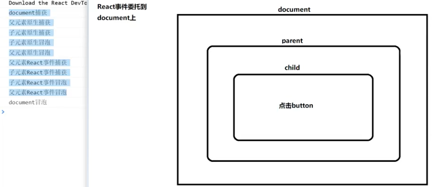
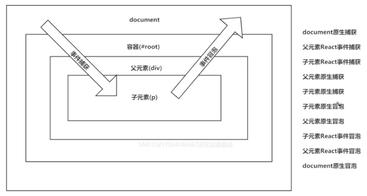
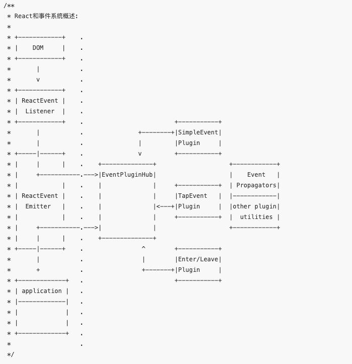
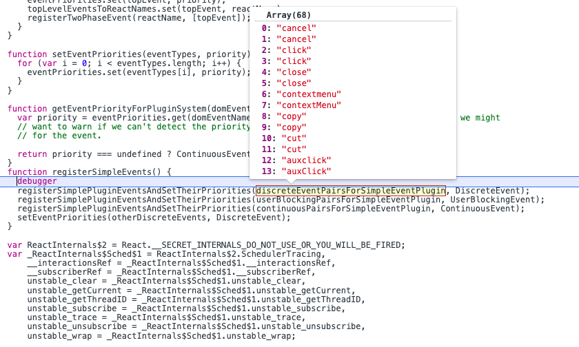

## React 合成事件

### React16 之前实例问题

**描述**：项目中点击按钮弹窗打开/关闭功能，点击按钮打开弹窗，点击弹窗区域外就关闭弹窗

```js
class MyModal extends React.Component {
  state = {
    isShow: false,
  };
  componentDidMount() {
    document.addEventListener("click", () => {
      this.setState({
        isShow: false,
      });
    });
  }

  handleClickButton = (event) => {
    /*
    event.stopPropagation()  // 不生效 这个event是react合成的  不是原生的
    event.nativeEvent.stopPropagation()  // 原生的也不生效 这个只是会阻止向上冒泡
    event.nativeEvent.stopImmediatePropagation() 生效
   */
    this.setState({
      isShow: true,
    });
  };

  render() {
    return (
      <div>
        <button onClick={this.handleClickButton}>按钮</button>

        {this.state.isShow && <div>我是弹窗</div>}
      </div>
    );
  }
}
```

**结果描述**

> 点击按钮 改变 state 的 isShow 状态为 true 显示弹窗

> 接着就是 改变 state 的 isShow 状态为 false 隐藏弹窗 **（结果是不显示 ）**

**bug 问题**

> react 合成事件绑定是在 document 上， 当点击了按钮后 最后会冒泡到 document 改变 fasle

**问题解决过程**

> 在点击后使用 合成事件 event.stopPropagation()阻止冒泡 (不生效)
> 在点击后使用 原生事件 event.nativeEvent.stopPropagation()阻止冒泡 (不生效)
> 在点击后使用 原生事件 event.nativeEvent.stopImmediatePropagation()阻止冒泡 (生效)

**知识点**

> stopPropagation 阻止向上冒泡，同级的兄弟节点监听事件继续执行

> stopImmediatePropagation 阻止向上冒泡，同级的兄弟节点监听事件禁止执行

### React17 实例

```js
class MyModal extends React.Component {
  state = {
    isShow: false,
  };
  componentDidMount() {
    document.addEventListener("click", () => {
      this.setState({
        isShow: false,
      });
    });
  }

  handleClickButton = (event) => {
    /*
    event.stopPropagation() 直接生效原因是 
    在react17 事件绑定了在了root   这个root阻止向上（document）
   
   */
    this.setState({
      isShow: true,
    });
  };

  render() {
    return (
      <div>
        <button onClick={this.handleClickButton}>按钮</button>

        {this.state.isShow && <div>我是弹窗</div>}
      </div>
    );
  }
}
```

### 概述

- react 通过事件冒泡，冒泡到 document 上以后，自行实现了一套事件机制
- 关键字 onClick 和之前原生 click 区分开来
- dom 触发事件后，先执行原生事件然后冒泡到 document 上，在执行 react 的冒泡事件

### react 16 的执行顺序



### react 17 的执行顺序



### 原理



### 实现过程

事件的流程分为三个阶段

- 事件的注册

  > 这个阶段有个方法 registerSimpleEvents()收集所有事件来生成 on-事件名字 map 集合
  > 

- 事件的绑定
- 事件的触发
