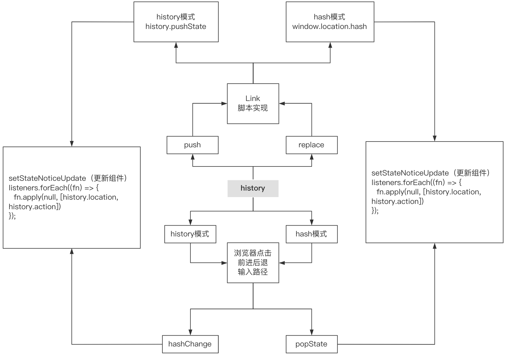

## 核心实现原理

### history

在 history 中记录了历史状态, 路由的改变， 路由的监听

> hash 模式下的 createHashHistory 利用 handleHashChange 事件来监听

> history 模式下的 createBrowserHistory 利用 handlePopState 事件来监听

#### 通用 api 实现方式

- push（通过 Link 点击）

```jsx
const handleLinkClick = (history) => {
  return (e) => {
    e.preventDefault();
    history.push(to); // 路径添加
  };
};


const setStateNoticeUpdate = (nextState) => {
    Object.assign(history, nextState); // 合并到history上 action动作
    listeners.forEach((fn) => {
      fn.apply(null, [history.location, history.action]);
    });
  };
push() {
  window.location.hash = path;
  setStateNoticeUpdate({
    action: "PUSH",
    location: createLocation(path),
  });
}

```

- listen（监听路由变换）

```jsx
const listen = (listener) => {
  listeners.push(listener);
  if (listeners.length === 1) {
    window.addEventListener("hashchange", handleHashChange);
  }
  return () => {
    // 卸载时候
    listeners = listeners.filter((item) => item !== listener);
    window.removeEventListener("hashchange", handleHashChange);
  };
};
```

### Router

- history location 等路由信息传递下去
- 初始化绑定 listen 负责监听路由 location 变换

### Switch

- 根据 正确唯一的 router，来渲染当前组件


